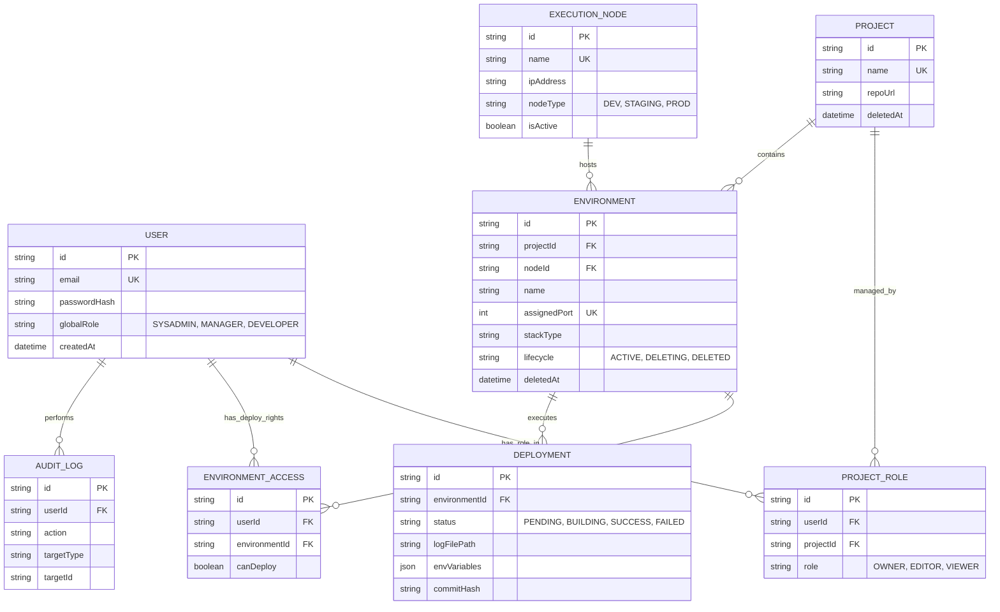

# Entity Relationship Diagram - Deploy Control Plane

The diagram below defines database relationships for the _Deploy_ system. This system applies _Global Role_ for the platform level, _Scoped Role_ for projects, and infrastructure metadata (_Execution Nodes_).

